Tandy 1000 EX/HX, PCjr videogames
=================================

This is a collection of Tandy/PCjr GW-BASIC games by **RufusPro (Brooks deForest)**.

They were released into the
public domain by the author and made available at
https://web.archive.org/web/20170222075609/brooksdeforest.com/tandy1000

Multiple-file Games
-------------------

#### Fluf (1989)
`fluf/` _Maze 'eat-em-up' game - 256k, 160x200x16 (joystick)._

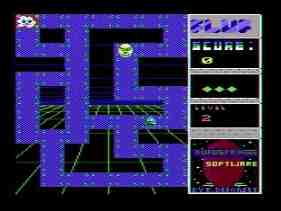

Fluf! is a Pacman clone where you cruise around a maze avoiding nasties, and changing the color of all the blocks before moving on the next level. Avoid the black holes (the funny looking square wooden tiles) as it's game over if your fall down one of them!

#### Toad Road (1990)
`toad/` _Guide your toad over the road - 256k, 160x200x16 (joystick)_

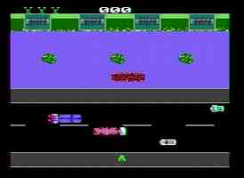

Toad Road is a Frogger clone where you guide your toad over the road dodging cars, trucks and snakes. Unlike frogs, toads need to keep moving in the direction of logs when on them! Use the joystick fire button to move forward - you can't go back!

#### Expo (1990)
`expo/` _Top down key collector - 256k, 160x200x16_

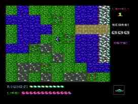

Expo is a top-down RPG game that has you walking around mazes, collecting keys and finding the exit before you run out of moves (or 'rounds').  To move use the keypad with the Num Lock on.

#### Turtle Racer (1988, missing)
_Need for speed-y turtles? - 256k, 160x200x16_

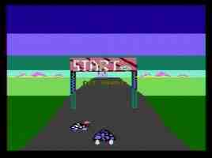

Single-file games
-----------------

| File           | Name            | Year  | Description
| -------------- | --------------- | ----- | --------------------------
| `breakoff.bas` | Breakoff        | 1989  | Arcade - 256k - 160x200x16 (joystick)   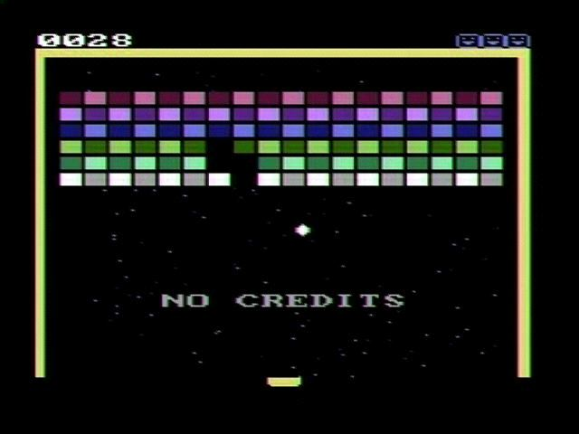
| `wgolf2.bas`   | World Golf 2    | 1990  | Sports Simulation - 256k - 160x200x16 (joystick)  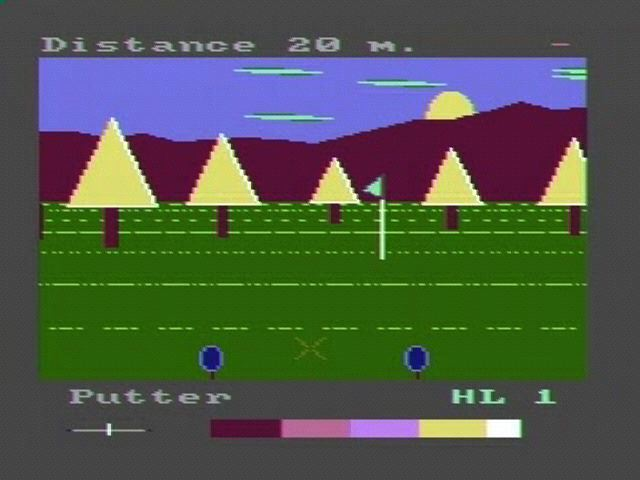
| `grayhnd.bas`  | Grayhound Racer | 1989  | Betting - 256k - 320x200x16   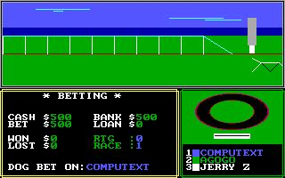
| `blackjck.bas` | Max Blackjack   | 1989  | Card Game - 256k - 160x200x16   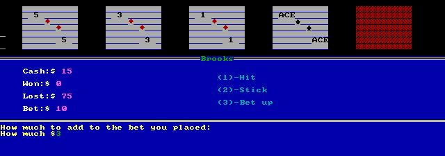
| `tactile.bas`  | Tactile         | 1989  | Strategy Board Game - 256k - 320x200x4  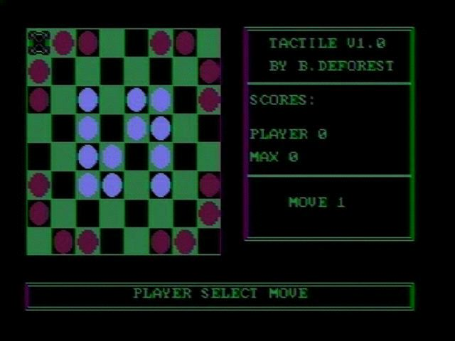
| `quasar.bas`   | Quasar          | 1990  | Space, Vector Game - 256k - 320x200x16 (joystick)  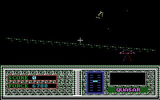
| `bomber.bas`   | Air Attack      | 1988  | Kids Arcade Game - 256k - 320x200x16  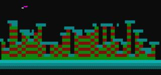
| `snakes.bas`   | Snakes          | 1988  | Top Down Collector - 256k - 320x200x16  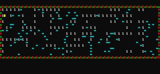

Other programs
--------------

| File           | Name                      | Year   | Description
| -------------- | ------------------------- | ------ | --------------------------
| `bob.bas`      | Bob                       | 1990/1 | 'AI' conversation program
| `supermap.bas` | Super Mapper              | 1990   | Generates 3D wireframe landscapes
| `vidfus.bas`   | Video Fusion              | 1990   | Vector graphics protocol editor for BBSes
| `rxmas.bas`    | The Really Big Rufus Xmas | 1989   | Animated Christmas Screen  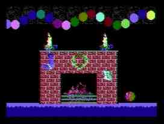

General Applications
--------------------

| File           | Name                      | Year   | Description
| -------------- | ------------------------- | ------ | --------------------------
| `vid3.bas`     | VID System 3              | 1991   | File utility and shell
| `supsheet.bas` | Supersheet Deluxe         | 1989   | Tandy 1000 spread sheet application

Graphics
--------

| File           | Name                      | Year   | Description
| -------------- | ------------------------- | ------ | --------------------------
| `cad.bas`      | Cadtext                   | 1988   | 16 color 80x25 text screen 'cad'
| `supart2.bas`  | Super Art 2               | 1989   | Tandy 1000 16 color 160x200 graphics program
| `rufdraw/`     | Rufus Draw Deluxe         | 1990   | Tandy 1000 16 color 320x200 graphics program
| `3drotate.bas` | 3D Rotate                 | 1989   | 4 color 320x200 prototype program
