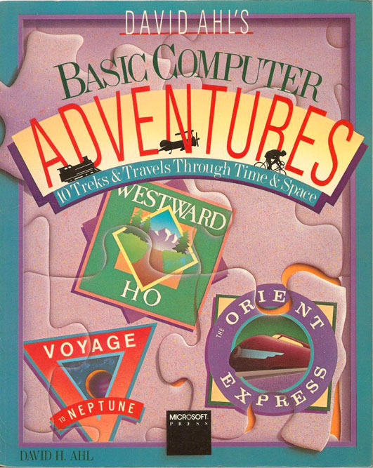

David Ahl's _BASIC Computer Adventures_
=======================================

These are the games from David Ahl's classic book. The book is and the games are available online at:
- http://www.atariarchives.org/bca/

with the following notice:

    These programs are now freeware: you may ignore the shareware notices.

Welcome to Basic Computer Adventures
--------------------------------------

The ten programs on this disk are simulations of actual and
imaginary journeys in which you, the player, take the role of the
leader of the expedition.
The programs originally appeared in the book, _Basic Computer Adventures_
by David H. Ahl, published by Microsoft Press in
1986 and reprinted in 1988.  We recommend that you try to find a
copy of the book, as it has a detailed story of each journey
along with maps, hints, and program notes.  You can certainly
make the journeys without the book, but it may take you a few
tries to get the hang of them.  

Brief descriptions follow:
* **Marco Polo** simulates a three-year journey over the Silk
Road in 1271.  It is easy to play once you get the hang of using
jewels in place of money.  However, it is a challenge to complete
the journey in three years with any jewels left over.
* **Westward Ho** simulates a six-month journey over the Oregon
Trail in 1850.  It uses the same framework as Marco Polo but,
because you have fewer resources, it is more difficult to finish.
* **The Longest Automobile Race** simulates the 1908 auto race
from New York to Paris (east to west).  Unreliable cars, treach-
erous roads, and unpredictable weather make this game tough.
* In **Orient Express**, you are a secret agent with assignments
to make contact with an arms dealer who wants to defect and to
arrest the killer of one of his former associates.  Clues are
provided by famous passengers who actually rode the Orient
Express.  The routing is real and follows the 1923 route from
London to Constantinople.
* **Amelia Earhart** simulates the around-the-world flight
attempt of the famous aviatrix in 1937.  If you load enough fuel
and pay attention to maintenance and repairs, you should be able
to reach Southeast Asia.  From there on, good luck.
* **Tour de France** simulates the famous three-week bicycle
race.  Along with intelligent decisions, this game requires
manual dexterity on the keyboard during the sprint stages.  There
is a short routine at the start to adjust the timing loop to your
computer, but we have found it doesn't always work correctly with
20MHz and faster machines.  You can still play the game though.
* **Appalachian Trail** simulates the trek of a hiker walking
the 2007 miles from Georgia to Maine.  Preparation is half the
key to completing the hike, but you'll have to contend with
boredom and make sensible decisions about eating and injuries.
* **Subway Scavenger** simulates the rounds of a messenger using
the New York Subway system.  During the first few plays of the
game, you must develop a map of the subway system.  Even with its
help, you will find this a challenging game to finish.
* **Hong Kong Hustle** simulates the Tai Pan collecting bags of
gold from various locations around Hong Kong.  Using the same
approach as Subway Scavenger, you must first develop a map and
then go for the gold.
* **Voyage to Neptune** simulates an imaginary journey to
Neptune in the year 2100.  It is a game of trading a tradeoffs.
It is not difficult to get to Neptune; it is very difficult to do
so in six years or less and have enough fuel for the return trip.

How to Load and Run the Programs
--------------------------------

The games are stored on the distribution disk in "tokenized"
Basic format.  They run under standard PC Basic or Microsoft GW
Basic.

Running the Programs from a Floppy Disk System:
Load Basic by placing your DOS disk in Drive A and typing
BASIC, BASICA, or GWBASIC.  Remove your DOS disk and place the
Basic Computer Adventures disk in Drive A.  From Basic, run the
games menu program by typing `RUN "M"`.  Follow the directions to
select the game you want.

Installing the Programs on a Hard Disk System:
Put the Basic Computer Adventures disk in Drive A.  Using
the `CD/` command, change directories and go to the directory where
Basic (BASIC, BASICA, or GWBASIC) resides.  From that directory,
type: `COPY A:*.*` and the 11 program files on the floppy disk will
be copied to your hard disk.

Running the Programs from a Hard Disk System:
After you have copied the programs onto your hard disk, load
Basic by typing BASIC, BASICA, or GWBASIC.  From Basic, run the
games menu program by typing `RUN "M"`.  Follow the directions to
select the game you want.

Exiting from a Journey:
When you finish a journey, the program will return you to
the menu program.  If you wish to exit a program before finishing
a journey, press Ctrl/C or Break, and you will be in Basic.  To
run another game, simply type `RUN "M"` again.

Sound Effects:
Several of the programs have sound effects that are set to
work with a "standard" 4.77 MHz PC.  On faster systems, they
sound rather strange.  If this bothers you, you can disable the
sound subroutines or rewrite the timing loops.  Please refer to
your Basic manual.
