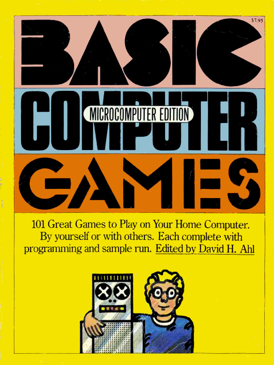

David Ahl's _BASIC Computer Games_
==================================

These are the games from David Ahl's classic book, as curated by Sam Moore at
- http://www.moorecad.com/classicbasic/index.html
- http://www.classicbasicgames.org/

The book is available online at
- http://www.atariarchives.org/basicgames/

| Program name | Description
|--------------|--------------
| Aceyducy | Acey Ducey card game.
| Amazing | Generates mazes.
| Animal | Guess the animal.
| Awari | African stone board game.
| Bagels | Numbers guessing game.
| Banner | Draw a banner.
| Basketball | Basketball game simulation.
| Battle Of The Numbers | Number strategy game.
| Battle | Battleship board strategy game.
| Blackjack | The card game 21, Vegas style.
| Bombardment | Bomb the hidden player positions.
| Bombs Away | Bomb run simulator.
| Bounce | Plot the bouncing ball.
| Bowling | Bowling simulator.
| Boxing | Boxing simulator.
| Bug | Draw the bug before the computer does (like Hangman).
| Bullfight | Bullfight simulator.
| Bullseye | Dart board simulator.
| Bunny | Draw a playboy bunny, not PC.
| Buzzword | Generate buzzwords for your next meeting.
| Calendar | Generate calendars (gads !! a useful program !).
| Change | Calculates correct change for item.
| Checkers | Checkers, yes, the board game.
| Chemist | Play with a chemical formula (game).
| Chief | Math game.
| Chomp | Find the cookie game.
| Civilwar | Civil War reenactment simulation. This game is missing.
| Combat | Battle simulation.
| Craps | Dice game simulation.
| Cube | Board game on the face of a cube.
| Depth charge | Bomb the submarine.
| Diamond | Prints diamond patterns.
| Dice | Simulate rolling dice and show probabilities.
| Digits | Guess the next digit.
| Even Wins | Even number of objects wins. Like NIM.
| Even Wins #2 | Another version
| Flip Flop | Change X's to O's..
| Football | Football simulation.
| Football #2 | Another version.
| Fur Trader | Fur trading simulation.
| Golf | Golf simulation.
| Gomoko | Oriental board game (GO).
| Guess | Guess the number.
| Gunner | Hit the target.
| Hammurabri | Kingdom simulation.
| Hangman | Guess the word, or else...
| Hello | Conversational (AI) simulator.
| Hexapawn | Board game simulation.
| Hi-lo | Money guessing game.
| Hi I-Q | The famous, very annoying, board game.
| Hockey | Hockey simulation.
| Horserace | Horse racing simulation.
| Hurkle | Hunt the hurkle on a grid.
| Kinema | Answer a kinetics question.
| King | Another kingdom simulation.
| Letter | Guess the letter.
| Life | Life simulation.
| Life For Two | Life as two player game.
| Literature Quiz | Child's book quiz.
| Love | Print in "love" font.
| Lunar LEM rocket | Simulate a lunar landing.
| Lunar LEM Rocket #2 | Simulate a lunar landing, another version.
| Lunar LEN rocket #3 | Simulate a lunar landing, yet another version.
| Master Mind | Crack a code.
| Math Dice | Math game using dice.
| Mugwump | Find the mugwump on a grid (why never a cube ? four dimensional ? N dimensional ?).
| Name | Does amusing things with your name.
| Nicomachus | Computer guesses what number you are thinking of (no, I'm not kidding).
| Nim | Move the stones game.
| Number | Guess the number (yes, again).
| One Check | Solitaire checkers.
| Orbit | Shoot a spaceship in orbit.
| Pizza | Deliver pizzas to a small town (I could not make this up).
| Poetry | Yep, generate random poetry.
| Poker | The classic card game.
| Queen | Game on chessboard with queens only.
| Reverse | Reverse a numbered list.
| Rock, Scissors, Paper | Yes, it is.
| Roulette | Roulette wheel simulator (leaves breaking both your legs up to your imagination).
| Russian Roulette | Yes, that. Sick.
| Salvo | Battleship again.
| Sine Wave | Draw sine waves.
| Slalom | Simulate skiing downhill.
| Slots | The one armed bandito.
| Splat | Parachute on various worlds of the solar system (a classic !!!).
| Stars | Simulates the formation of stars from primordial material in the universe.
| Kidding. Its another guess the number game !!!!
| Stock Market | Stock market simulation (leaves the house repossession to your imagination).
| Super Star Trek | Star Trek, The TV show. This program is missing from the collection.
| Synonym | Synonym knowledge test (you needed this, right ?).
| Target | Another shoot the target game.
| 3-D Plot | Plots curves of any function.
| 3-D Tic-Tac-Toe | Tic Tac toe, but more confusing.
| Tic Tac Toe | Yep. Lots of tie games.
| Tic Tac Toe #2 | Another version.
| Tower | Towers of Hanoi, a stacking puzzle.
| Train | Generate time-speed-distance problems.
| Trap | Yep! Another guess the number game !
| 23 Matches | Takeaway matches game.
| War | The card game. Yes, it takes forever, how did you know ?
| Weekday | Interesting facts about a date.
| Word | Guess the word !
