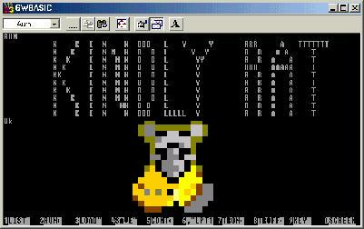

 

GW-BASIC
========

 

 

GWBASIC GAMES
---

`dominoes`    ...    a good dominoes game  
`chess1`    ...    chess game by RAKASKA  
`SLOT`    ...    slot machine game by ROCHE FAHLANEIGH  
`MNPLY`    ...    monoply game by ROCHE FAHLANEIGH  
`bluesbox`    ...    a song writing / playing program  
`checkers`    ...    a good but dumb game  
`SantaParavia`    ...    ( UNDER DEVELOPMENT )  
`lemonade`    ...    run a lemonade stand  
`HAMURABI`    ...    rule a primitive society  
`Slot6`    ...    a good slot machine game  
`Pic3`    ...    draws random colorful rectangles  
`BATNUM`    ...    a good math game. add line `110 RANDOMIZE TIMER` for better random numbers  
`23mtch`    ...     an old 23 Match game  
`aceydu`    ...     acey deucy anyone?  
`buzzwd`    ...     a buzzword creator  
`chomp`    ...     two or more players. from ScientificAmerican  
`craps`    ...     a good craps game  
`stars`    ...     a number guessing game  
`fibonacc`    ...     a Fibonacci Series Calculator  
`mugwmp`    ...     find the mugwmp on a 10 X 10 grid  
`eliza`    ...     an artificial intelligence game  
`nim`    ...     a good NIM game, use caps  
`salvo1`    ...    an artillery game

CODE EXAMPLES
---

`archie`    ...    learn Structured BASIC Programming!  
`sequential`    ...    demonstrates search, list first and read  
`circles`    ...     random circles in `SCREEN 1`  
`SDOFRND2`    ...     predict future by random generators  
`snails`    ...    population sampeling theory test  
`PIBAS`    ...    PI calculation by the casino method  
`RootSumSquare`    ...     prove a calculation method  
`factor`    ...     finds the factors of numbers  
`demo2`    ...     old Zenith BASIC graphics demo  
`menuet`    ...     PLAY music demonstration  
`binary`    ...    demonstrates search, list first and read  
`dietest`    ...    checks the Random Generator  
`two-buffer`    ...    demonstrates sort of `A$`, list first and read  
`bubble`    ...    demonstrates sort of `A$`, list first and read  
`Mandelbrot`    ...    Mandelbrot Fractal demonstration  
`ListDisk`    ...     by Eric Tchong, formats BASIC programs for listing or printing.  
`SortThem`    ...     another Eric Tchong QuickBASIC program that demonstrates sorts.  
`RanHex`    ...    random hexadecimal generator  
`Cypher`    ...    a text encoding program  
`AnimalVegtableMineral`    ...    a game/example that learns  
`99bob`    ...    demonstrates messing around in BASIC  
`combinations`    ...    possible combinations of three numbers  
`MorseConverter`    ...    converts a message to Morse Code.

KindlyRat

 
